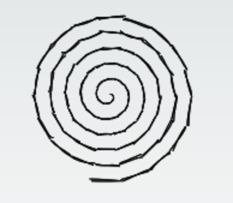
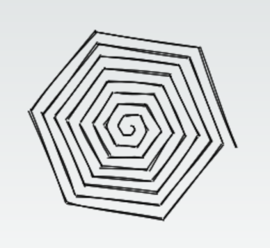

# Plumeto

This is a drawing application for [turtle graphics](https://en.wikipedia.org/wiki/Turtle_graphics) using a custom scripting language based on [LOGO](https://en.wikipedia.org/wiki/Logo_(programming_language)). Made in inspiration of a highschool project I lost the code of.

## Plumeto language

Formal launguage definition can be found at `src/language/grammar.pegjs`. In a nutshell, it is a simple procedural language with a somewhat C-like syntax.

### Examples

**Spiral**
``` js
for x in 1..100 {
  forward x / 4
  rotate 20 deg
}
```
Output:


**Hexpiral**
``` js
for x in 1..100 {
  forward 2 * x
  rotate 60.2 deg
}
```
Output:


## Development

Plumeto is built with Next.js, [peggy](https://github.com/peggyjs/peggy) for parser generation and [roughjs](https://github.com/rough-stuff/rough) to draw on canvas in a sketchy style.

To run the development server:

```bash
npm run dev
```

Open [http://localhost:3000](http://localhost:3000) with your browser to see the result.

You can start editing the page by modifying `pages/index.tsx`. The page auto-updates as you edit the file.

If you make changes to the grammar in `src/language/grammar.pegjs` update the generated parser by running

```bash
npm run grammar
```

## Roadmap
- Demo
  - Add demo
  - Add examples
- Language
  - Add comments support
  - Add mathematical functions
  - Random function
  - Turing completeness
  - Functions
  - Full support for L-systems
  - Other cool stuff
- UX
  - Fix styles
  - Panning
  - Handle parsing errors
  - Colors
- Tests
