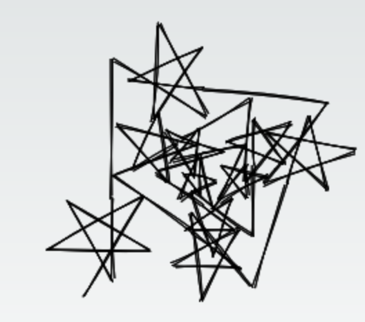
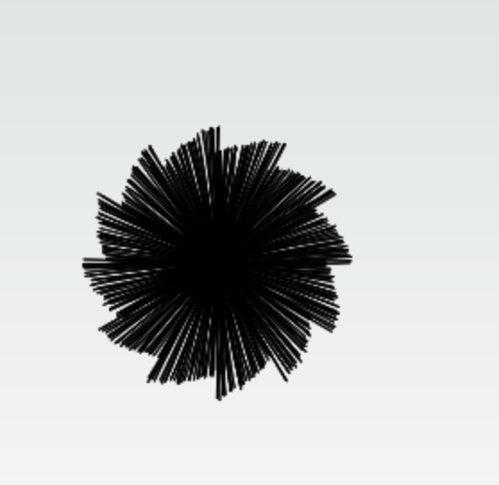
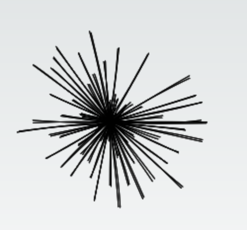

# Plumeto

This is a drawing application for [turtle graphics](https://en.wikipedia.org/wiki/Turtle_graphics) using a custom scripting language based on [LOGO](https://en.wikipedia.org/wiki/Logo_(programming_language)). Made in inspiration of a highschool project I lost the code of. It is also able to draw [L-systems](https://en.wikipedia.org/wiki/L-system).

## Plumeto language

Formal launguage definition can be found at `src/language/grammar.pegjs`. In a nutshell, it is a simple procedural language with a somewhat C-like syntax.

### Examples

See `examples/` folder.
|Script|Output|
|-|-|
|**weed(stochastic,2rounds)**|.png)|
|**spiral**||
|**hexpiral**||
|**penta-doodle**||
|**saw**||
|**stick-saw**||
|**star**||

## Development

Plumeto is built with Next.js, [peggy](https://github.com/peggyjs/peggy) for parser generation and [roughjs](https://github.com/rough-stuff/rough) to draw on canvas in a sketchy style.

To run the development server:

```bash
npm run dev
```

Open [http://localhost:3000](http://localhost:3000) with your browser to see the result.

You can start editing the page by modifying `pages/index.tsx`. The page auto-updates as you edit the file.

If you make changes to the grammar in `src/language/grammar.pegjs` update the generated parser by running

```bash
npm run grammar
```

## Roadmap
- Demo
  - Add live demo with examples
- Language
  - Fix expression bug where it doesn't accept expected expressions such as
    - a*4+sin(x)
  - Fix parsing bugs in general
  - Add comments support
  - Fix return statements, they don't work if nested.
  - Turing completeness (only needs memory?)
  - Full support for L-systems (done?)
  - Other cool stuff
- UX
  - Fix styles
  - Panning
  - Handle parsing errors
  - Colors
- Tests
